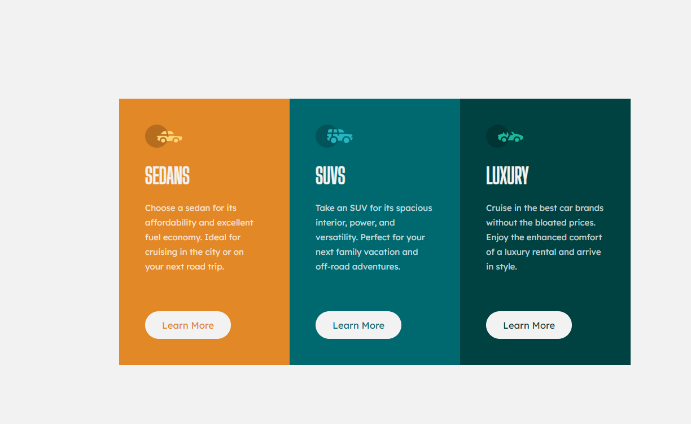
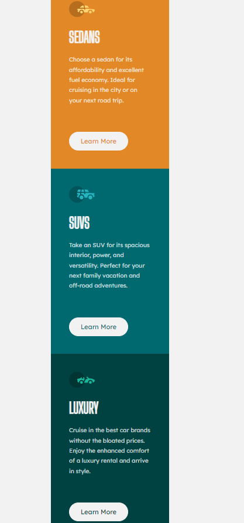

# Frontend Mentor - 3-column preview card component solution

This is a solution to the [3-column preview card component challenge on Frontend Mentor](https://www.frontendmentor.io/challenges/3column-preview-card-component-pH92eAR2-). Frontend Mentor challenges help you improve your coding skills by building realistic projects.

## Table of contents

- [Overview](#overview)
  - [The challenge](#the-challenge)
  - [Screenshot](#screenshot)
  - [Links](#links)
- [My process](#my-process)
  - [Built with](#built-with)
  - [What I learned](#what-i-learned)
  - [Continued development](#continued-development)
  - [Useful resources](#useful-resources)
- [Author](#author)
- [Acknowledgments](#acknowledgments)

## Overview

### The challenge

Users should be able to:

- View the optimal layout depending on their device's screen size
- See hover states for interactive elements

### Screenshot




### Links

- Solution URL: [Add solution URL here](https://your-solution-url.com)
- Live Site URL: [Add live site URL here](https://your-live-site-url.com)

## My process

### Built with

- Semantic HTML5 markup
- CSS 3
- Flexbox

### What I learned

```html
<h1>
  Some HTML code I'm proud of the use of <br />
  it really helped me out
</h1>
```

```css
.proud-of-this-css {
  display: flex i got a better understanding of it whilst i worked on this
    project.;
    also i got use the [import url()] function to import some fonts in my project
    i also applied [line height ] to my text
}
```

### Continued development

i want to have a better understanding of flexbox, justify-content, align-items, postion and transform.

### Useful resources

Chat gpt gave a solution on how to import fonts into my projects.

## Author

- Frontend Mentor - [@dunt21](https://www.frontendmentor.io/profile/dunt21)

## Acknowledgments

Mr.Jude was the one who introduced me to this challenge to perfect my skills in css.
